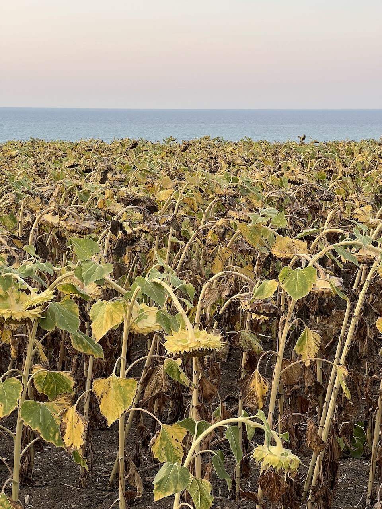
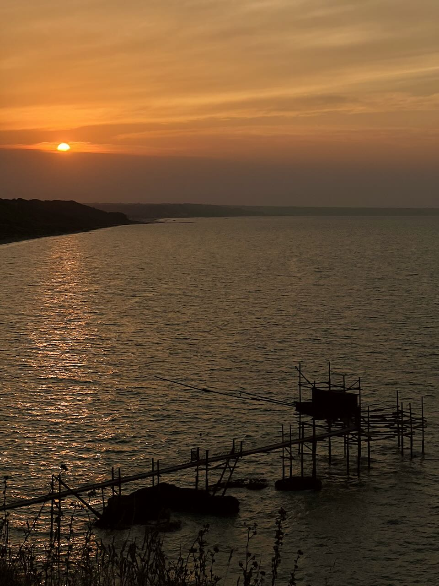

> "L'hai vista 'L'eclisse'? Io c'ho dormito, 'na bella pennichella... Bel regista Antonioni!"
> 
> *Il sorpasso, Dino Risi*

C'è un posto paradossale sulla Costa Adriatica, qualche km a nord di Vasto. Affaccia dove il sole sorge, ma concede anche il lusso di guardarlo scendere sul mare, soprattutto in estate, poco prima di nascondersi dietro il Gran Sasso.

È Punta Aderci, promontorio selvaggio che prova a difendersi da porti e fabbriche, cemento e ferro, uomo e natura. Non è di certo l'unico posto che offra l'illusione di alba e tramonto, ma è caro a molti.

Qualche metro prima del promontorio, a Punta Aderci, sono tornati dopo un po' di anni i girasoli. Hanno scelto l'anno sbagliato, infuocati da un agosto infernale. Contrariati da un sole troppo insistente, se ne sono stati indifferenti a guardare dall'altra parte, incuranti di tutta questa gente che cercava di bruciarsi le retine per sottrarle allo stillicidio quotidiano di meraviglia e oscenità.

Punta Aderci è stato il posto ideale dove godersi lo spettacolo in quel quarto d'ora di tregua concessoci dalle nuvole prima di sfidare la luna a chi sapesse toglierci più luce, lasciando la lunghissima passerella del trabocco in seducente penombra.

