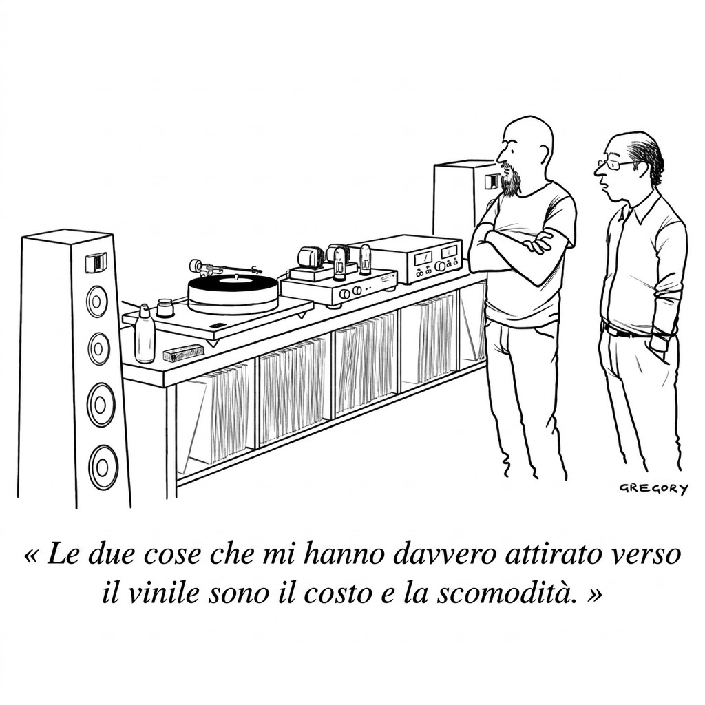

Scopro l'acqua calda: avere a disposizione cataloghi sterminati di cose da ascoltare, vedere, leggere finisce per togliere gran parte del gusto dell'ascolto, della visione, della lettura. Perdiamo tempo a scegliere, a essere indecisi, invece che a fruire e godere di tutto quello che è disponibile. Avere tutto è quasi come non avere niente.

Ho comprato un giradischi, contraddicendo ogni voce interiore che mi diceva che era inutile farlo. Non è del resto inutile (inessenziale) anche affacciarsi sul Grand Canyon, leggere Federico García Lorca, bere un Trebbiano Valentini, fare un'esperienza culinaria in un gran ristorante? Chi definisce cosa sia utile o inutile?

Un pomeriggio ho deciso allora di dimenticarmi del rapporto segnale/rumore a dir poco sfavorevole dell'ascolto in vinile rispetto a quello in CD, del teorema di Shannon e di tutta una serie di altre certezze (sacrosante e proprio per questo dimenticabili), e mi sono buttato sull'imperfezione, sulla lentezza, sul rumore. Sul gusto di spendere dei soldi per un oggetto fisico da scartare, annusare, prendere tra le dita, posare su un piatto, custodire senza maltrattare, ascoltare da capo a coda senza la tentazione di fare zapping.

Sul rito, sulla calma, sull'assaggio paziente e non sull'abbuffata compulsiva. Tutte cose che si potrebbero fare comunque con la musica liquida o con la già ingombrante collezione di compact disc accumulata in qualche anno di passione, ma questa volta mi andava così: tra spazzole per togliere la polvere, buste antistatiche, puntine coniche o microlineari, lavaggio con la vodka del supermercato o con l'acqua distillata. Follie del genere, tra un crepitio e un fruscio, perché [la qualità ci ha rotto il cazzo](https://www.youtube.com/watch?v=96x2pjWoTCY).  

