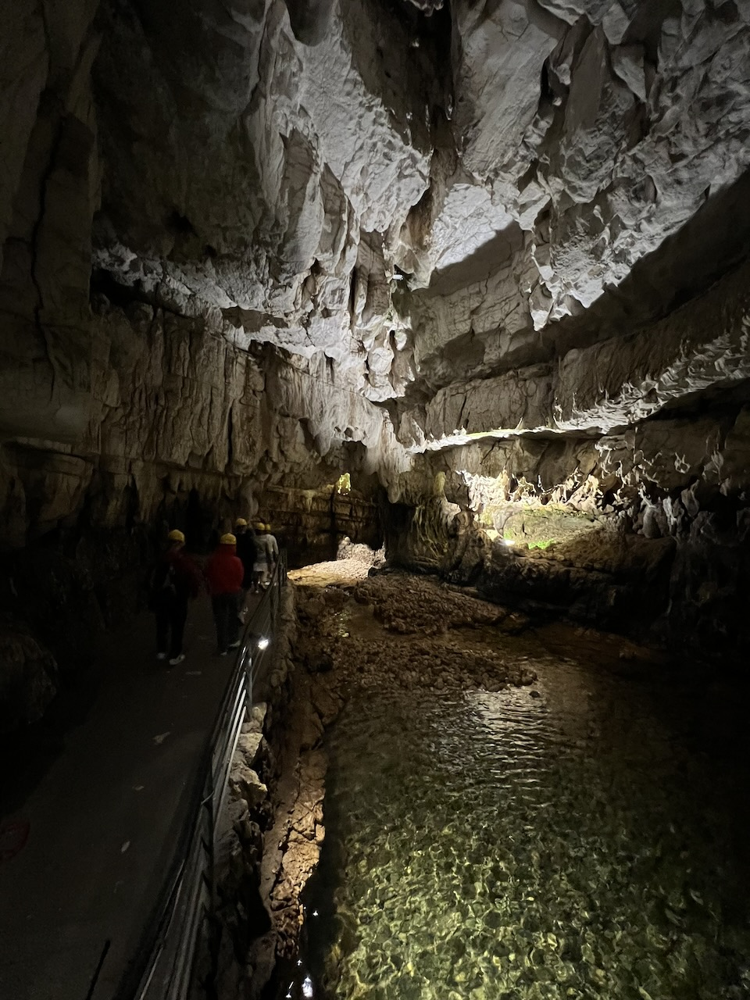
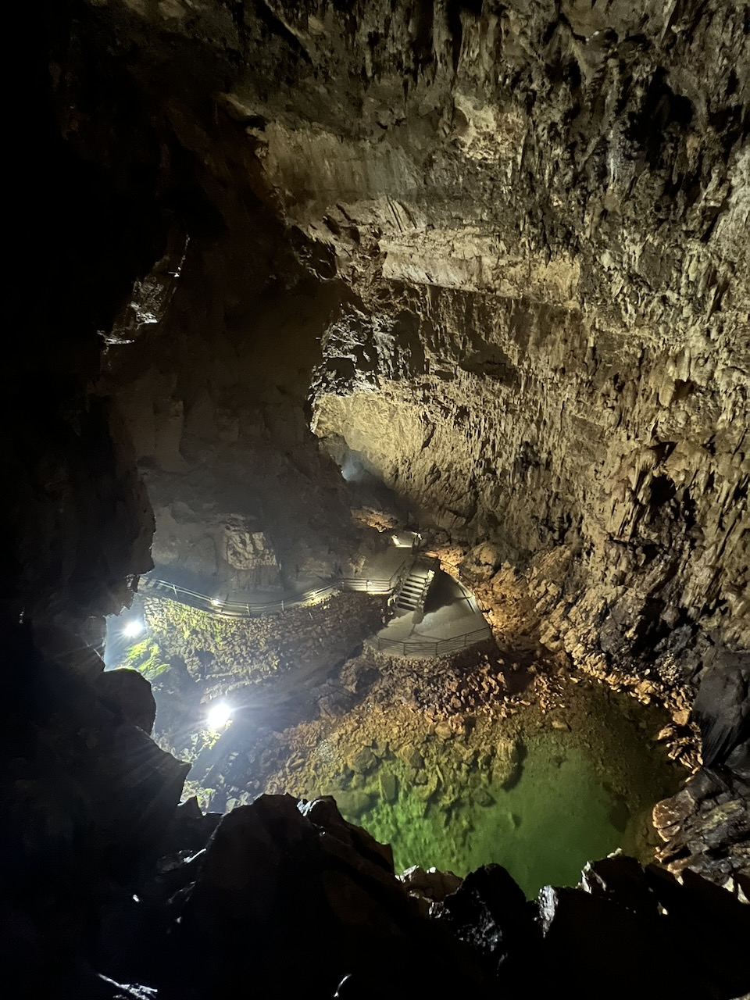
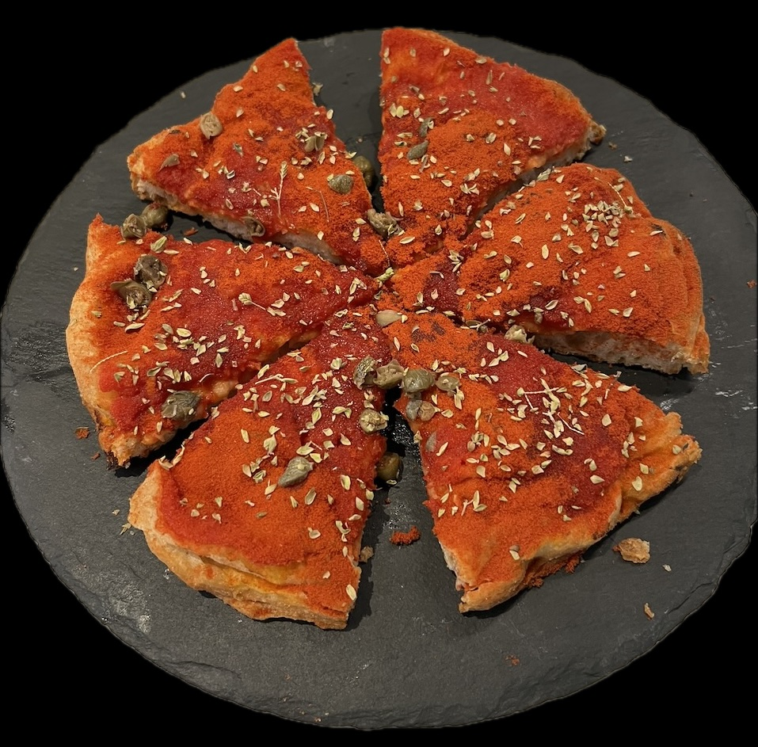

Nella smania dissennata di trovare qualcosa da fare a Ferragosto (malattia che evidentemente mi ha contagiato), è parso a me e ai compagni di sventura che cercare un'ora di sollievo dalla fornace estiva fosse una buona linea guida. E allora grotte, caschetto, felpa e aria rarefatta. Nella porzione d'Abruzzo dove ho passato gran parte degli ultimi 20 anni ci sono le grotte di Stiffe, bell'esempio di grotte "bambine" (l'ho ovviamente scoperto ascoltando le ottime guide) e non del tutto esplorate.

Le avevo già visitate un paio di volte, ma mai - proprio mai - mi avevano fatto pensare in modo folgorante come ieri a un pezzo della mia infanzia che devo reputare responsabile (in positivo, vorrei dire) di parte di quel che sono oggi. Si tratta di un videogioco, Final Fantasy VII, di un genere di cui non potevo lontanamente sospettare l'esistenza quando lo comprai nel '98 o '99, forse, rigorosamente in edizione Platinum da poveracci.

("Lo comprai" mi sembra grandemente esagerato: me lo comprarono i miei, che le 5000 lire per i gelati di nonna e nonnò credo di averle destinate a cose meno durevoli)

Final Fantasy VII, come molti giochi di ruolo di ambientazione fantastica, ha qualche parte ambientata in grotte, caverne, o scenari del genere. Ed è davanti a questo spettacolo che io mi sono sentito una specie di Cloud Strife (senza spadone e senza chioma bionda) alle prese con la Shinra:

Credo che chiunque abbia giocato Final Fantasy VII possa avere la stessa sensazione folgorante, o almeno me lo auguro.

Final Fantasy VII, oltre a personaggi e storia memorabili, a una colonna sonora degna di sedere al fianco delle più grandi colonne sonore del cinema, ebbe un altro merito molto più personale: mi insegnò un bel pezzo d'inglese. Non venne mai tradotto in italiano, e quando inserii il primo disco (ma forse lo sapevo già leggendo la copertina o il retro), mi trovai davanti alla necessità tra scegliere di non giocare mai un gioco che già all'uscita era stato messo tra i grandi capolavori del genere, e quella di adoperarmi per capirne i dialoghi - che in quel genere sono sostanzialmente la cosa più importante. Non so come, non so in quanto tempo, non so nemmeno esattamente se sia proprio così, ma finii per imparare passo passo a capire quel che si diceva nelle caselle di dialogo in blu, e ricordo ancora di aver usato, sulla mia sediolina davanti alla tv del salotto di casa, un dizionario inglese-italiano di quelli in portatili (*tascabili* direi proprio di no), con una copertina verde fluo. 

Ma si sa, non di sole fantasie finali vive l'uomo, e non di solo pane. Vive infatti molto meglio di pane e olio, e così - tornati a riveder il sole - fuori dalle grotte di Stiffe siamo andati a pranzo in un posto che mi sento di consigliare a chiunque si trovasse a lottare la Shinra nell'aquilano: [Paneolio](https://www.tripadvisor.it/Restaurant_Review-g1193415-d6484351-Reviews-Paneolio_Cucina_Contemporanea-Poggio_Picenze_Province_of_L_Aquila_Abruzzo.html), che tra le varie cose fa una pizza da provare.

Dopo ieri mi è venuta una gran voglia di rigiocare Final Fantasy VII: cerco di tamponarla per adesso riascoltandone la colonna sonora, che resta una pura meraviglia.

https://www.youtube.com/watch?v=Ej_JNBOIAz8&list=PLFAC04AA2B8A98151&index=2